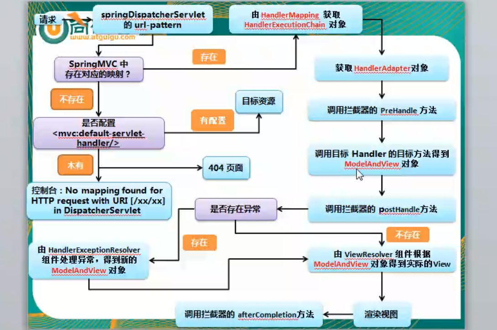

# spring-mvc 笔记

## HelloWord

### 新建项目

[参考链接]( https://www.cnblogs.com/shang-shang/p/7477607.html)

1. 使用 idea 新建 maven 项目，选择 webapp 文件架构

2. 在  pom.xml 中添加 spring-mvc 包

   > - spring 类
   > - spring-core
   > - spring-bean
   > - spring-context
   > - spring-aop
   > - spring-expression
   > - spring-web 类
   > - spring-web
   > - spring-mvc
   > - 日志
   > - commons-logging

   ```xml
     <properties>
       <!-- spring版本号 -->
       <spring.version>4.1.1.RELEASE</spring.version>
     </properties>  

   <dependencies>
            <!-- https://mvnrepository.com/artifact/commons-logging/commons-logging -->
         <dependency>
             <groupId>commons-logging</groupId>
             <artifactId>commons-logging</artifactId>
             <version>1.1.3</version>
         </dependency>

         <!-- springMVC核心包 -->
         <dependency>
             <groupId>org.springframework</groupId>
             <artifactId>spring-webmvc</artifactId>
             <version>${spring.version}</version>
         </dependency>

         <!-- spring核心包 -->
         <dependency>
             <groupId>org.springframework</groupId>
             <artifactId>spring-core</artifactId>
             <version>${spring.version}</version>
         </dependency>

         <dependency>
             <groupId>org.springframework</groupId>
             <artifactId>spring-beans</artifactId>
             <version>${spring.version}</version>
         </dependency>

         <dependency>
             <groupId>org.springframework</groupId>
             <artifactId>spring-context</artifactId>
             <version>${spring.version}</version>
         </dependency>

         <dependency>
             <groupId>org.springframework</groupId>
             <artifactId>spring-context-support</artifactId>
             <version>${spring.version}</version>
         </dependency>

         <dependency>
             <groupId>org.springframework</groupId>
             <artifactId>spring-aop</artifactId>
             <version>${spring.version}</version>
         </dependency>

         <dependency>
             <groupId>org.springframework</groupId>
             <artifactId>spring-web</artifactId>
             <version>${spring.version}</version>
         </dependency>

         <dependency>
             <groupId>org.springframework</groupId>
             <artifactId>spring-expression</artifactId>
             <version>${spring.version}</version>
         </dependency>

     </dependencies>
   ```

3. 添加 IDE 对框架的支持

   在项目文件夹，右键 add Framework support, 添加  spring 和 spring mvc

   > 如果找不到，那么 Ctrl+alt+shift+S 打开 Project structure -> 左侧 Modules 删除 Spirng 即可

4. 打开 web.xml 配置 核心 DispatcherServlet

   - 可以使用默认的 文件读取位置，默认为 \<servlet-name\>-servlet.xml 在 WEB-INF 下面
   - 也可使用 自定义的 xml 位置
   - 配置 servlet 的 mapping 规则，`/` 接管全部 URL 请求

5. 编写一个 Controller 类，使用 @Controller 注解

   - 为了让 spring 扫描到，因此在 \<servlet-name\>-servlet.xml  中 加入 `<context:component-scan base-package="edu.ouc.it.springmvc"/>`
   - 编写 具体的方法 处理 不同的 URL 请求， @RequestMapping("url") 

6. 具体方法返回视图的名称，spirngmvc的内部视图处理其读取的文件所在位置 为 prefix + returnString + suffix 

   > 使用到 内部视图处理器，因此需要在 mvc的xml 里面配置 

## 注解 @RequestMapping

1. 可以使用在 方法上，也可以使用在类上

2. @RequestMapping(value="url", method=RequestMethod.POST [,params = , headers=.... )

3. parmas={“string”,"string"}  

   > 规则：
   >
   > - {"p1","p2"} 必须包括才匹配
   > - {"p1","p2！=10"} 必须包括p1匹配,p2可以不包括，但是包括的话不能为10
   > - {""!p2"} 不能不能包括 p2

   headers 也是一样的 {"host=sssss"}headers 也是一样的 {"host=sssss"}

   支持 ant 风格 url 匹配
   ANT通配符有三种：
   | 通配符  | 说明           |
   | ---- | ------------ |
   | ?    | 匹配任何单字符      |
   | *    | 匹配0或者任意数量的字符 |
   | **   | 匹配0或者更多的目录   |

   例子：
   | URL路径              | 说明                                       |
   | ------------------ | ---------------------------------------- |
   | /app/*.x           | 匹配(Matches)所有在app路径下的.x文件                |
   | /app/p?ttern       | 匹配(Matches) /app/pattern 和 /app/pXttern,但是不包括/app/pttern |
   | /**/example        | 匹配(Matches) /app/example, /app/foo/example, 和 /example |
   | /app/**/dir/file.* | 匹配(Matches) /app/dir/file.jsp, /app/foo/dir/file.html,/app/foo/bar/dir/file.pdf, 和 /app/dir/file.java |
   | /**/*.jsp          | 匹配(Matches)任何的.jsp 文件                    |

   > 最长匹配原则(has more characters)
   > 说明，URL请求/app/dir/file.jsp，现在存在两个路径匹配模式/**/*.jsp和/app/dir/*.jsp，那么会根据模式/app/dir/*.jsp来匹配

   匹配规则 可以 放入占位符 "test/{id}/{name}"
   提取占位符方法：@PathVariable("占位符") 

   `public String  xx (@PathVariable("id") Integer id, @PathVariable("age") Integer age )`

   > 注：函数中 类型可以作为 占位符的类型检查，如果不正确不会调用此函数
   >
   > 也就是说 {id} @PathVariable Integer i  当 url: test/hhh/ 这样的是不对的，不会被响应，必须是数字


   ## 实现REST风格

定义：get 获取  post 新增  put 修改 delete 删除

1. 配合 @RequestMapping(value="url", method="POST/GET/PUT/DELETE")

2. 由于 form 表单只能发 POST 因此 使用一个 隐藏的 input 提交上来是什么请求，指名 PUT , DELETE。 默认 _method ，这个可以在 web.xml 中配置

   `<input type="hidden" name="_method" value="put">`

3. 然后在 java中使用 过滤器统一处理这个 hidden input  是什么请求，重新包装一下 request 交给 controller。过滤器是 HiddenHttpMethodFilter

   在 web.xml 中配置 过滤器

4. 如果直接使用 jquery 发送 AJAX 就不用这么复杂了，直接在发送的是时候 type:put /delete  即可

5. > 在使用 REST 时候，渲染 jsp 视图会失败（提示 不支持 PUT,DELETE 方法），因为 tomcat 不承认 PUT,delete 请求。 [参见链接](https://blog.csdn.net/langmian4982/article/details/77888109)
   >
   > 因此返回 ResponseBody 纯文字即可（方法上 @ResponseBody）

## 注解 @RequestParam   @RequestHeader

1. 获取问号请求参数

2. value 为请求参数名字

3. required 是否必须，默认必须

4. defaultValue 请求参数默认值，当 required=false，如果使用 包装类型 那么默认为 null，如果是基本类型那么就会出错，所以需要这个 defaultValue 

## 注解 @CookieValue

获取一个cookie 的值

##  自动封装POJO对象 

1. 自动封装 POJO 可以级联，不需要一项一项赋值

2. 配合前端 \<input name = "pojo.attr"\ >   

   级联属性：dept.deptId、dept.address.tel  

3. 只要在 Handler 处理方法的参数中 用到了 pojo 那么 request域中就会留存这个对象

   搜集到 ${requestScope.class(第一个字母小写)}  --- 这是默认情况 

   在方法中使用  @ModelAttribute value 可以自定义,前端使用 ${requestScop.pojo_class}

   `public String TestPojo(@ModelAttribute("pojo_class") UseR user1)`

4. 原理:  [参考](http://www.icoolxue.com/play/3622)

   springmvc 将 表单参数 装填到 方法的入口参数的 UesrR 对象时候

   - 首先寻找 requestScope 中是否有存在 名称为 attrName 的对象（默认是 第一个字母小写类名 或 @ModelAttribute value给出）。若存在，ok
   - 若不存在：看 Handler 类是否被 @SeesionAttributes修饰。若修饰了看 SessionScope 中是否有存在 名称为 attrName 的对象（默认是 第一个字母小写类名 或 @ModelAttribute value给出，若不存在抛异常
   - 若 没有被修饰 并且 都没有就使用反射创建这个对象
   - 最后将表单的值通通赋值到这个对象
   - 并且 这个对象被 加入到 RequestScope 中

## @Controller 的类 对原生 servlet API 支持

Controller 的类 对原生 servlet API 支持方法中的参数可以传入

-  HttpServletRequest
-  HttpServletResponse
-  HttpSession
-  java.security.Principal
-  Locale
-  InputStream
-  OutputStream
-  Reader
-  Writer
## 视图模型渲染

1. Handler 方法返回 ModelAndView对象，在前台 `${requestScope.xxx.xxx.xxx}`

   原理: 实际上是添加到了 原生 servlet 的 request 域中

2. Handler 方法参数放入 Map\<String, Object\>  返回值还是渲染的视图名字

   使用 map.put(key,value)    

   还是处在 request 域中, put 到 Map 中的对象在前台使用一定是 `${requestScope.key}`要和 pojo那种按照类型收集的区别开

3. Session级别的数据保存

   - 使用 @SessionAttributes  放在 类上面进行注解，前端 ${sessionScope.xxx.xxx.xx}

   - 两种方式

     - 使用 value 对  类中方法的 map 入参中的 key 进行标识，存为 session 域

     - 使用 type 对类中 方法的map 入参中的 value.class 进行 同类型键值对的保存

     - 查看定义 value是String[]   type是 Class<?>[] 

## 注解@ModelAttribute

1. 使用场景： 更新数据库对象部分值，一部分保持原来不变

2. 被 `@ModelAttribute`修饰的方法会在任何本类的方法执行的时候执行一遍

3. 代码

   ```java
       @ModelAttribute
       public void getUser1(@RequestParam(value="id", required=false) Integer id,
                           Map<String, Object> map){
           System.out.println("查询数据库得到对象"+"id==="+id);
           if(id!=null){//必须有这个判断，减少放入 requestScope 的次数
           UseR user = new UseR(1,"sty",12);
           map.put("user", user);//这个 key 看 POJO 有没有使用 @ModelAttribute修饰，如果有那么就是使用 value 否则 类名称第一个字母小写
           System.out.println("exec");
           }
       }
   ```

## \<mvc:view-controller\> 实现直接页面请求不走 Handler内部转发

   1. 在 mvc控制器的.xml 中添加  `<mvc:view-controller path="" view-name="视图名字" >`
   2. 但是这样做 Handler 中的内部转发会出问题，so 添加 `<mvc:annotation-driven></mvc:annotation-driven>`

## 自定义视图

   1. 自定义视图用途较为广泛，相当于自己定义一个返回的 数据包内容（例如，json，text/html，jpeg.....

   2. ​这个也是在 Handler 的 方法中返回String就行

   3. 需要使用到的视图解析器为 `BeanNameViewResolver`,但是此时 mvc控制器.xml 出现了两个视图解析器，上文提到的  `InternalResourceViewResolver`解析器，因此需要有顺序。通过 配置 `property`中的 order 属性实现顺序。 order越大优先级越低。

      并且把不常用的置为高优先级，优先看看是否符合那个要求。

   4. 自己实现的  自定义视图类 需要实现 ` View`接口。

   5. springmvc 提供了 excel 的一种抽象实现 `AbstractExcelView`

## 重定向，转发

1. 在Handler 方法中，的 return 中 StartWith ，可以是文件，也可以是 url

   - "redirect:/index.jsp"  或者 "redirect: url"
   - "forward:/index.jsp"  或者 "forward: url"

   > 注意 url 的绝对路径和相对路径，相对路径是
   >
   > - Handler 类被 @RequestMapping("/test") 修饰，那么 `return "redirect: 111/222";` 
   >
   >   重定向地址为：`/test/111/222`
   >
   > - 若 `return "redirect: ../111/222";`  则相对于 类上面 RequstMapping 作为相对目录进行寻找

## springmvc 提供了一些服务器标签 

在 JSP 页面上面引入 taglib  即可

## springmvc 解决静态资源

1. 需要在 中央处理器.xml 中配置，静态资源不进行 Handler处理

   添加 `<mvc:default-servlet-handler default-servlet-name="default"/>`

   default-servlet-name 这个属性根据 tomcat 中处理静态资源的 servlet 对应。默认为default

2. 作用：对进入 中央处理器的 uri 进行处理，如果在中央处理器中没有映射的 uri 那么就会交给 web 容器的servlet 处理，如果 web 容器判定不是静态资源，那么在交给中央处理器报告后续的事情（例如，抛出异常。。。）

3. 

## <mvc:annotation-driven>

1. 作用：主要为了解决 不进入 Handler 而直接响应 URI 的请求 导致的 无法进行 Handler 处理的情况
2. 使用场景： 一下情况都需要加这个才行
   - 使用了静态资源的 `<mvc:default-servlet-handler default-servlet-name="default"/>`
   - 使用了直接响应 url 的 `<mvc:view-controller path="" view-name="视图名字" >`
   - 使用自定义类型转换器，配置 \<<mvc:annotation-driven> convsersion-service\>
3. 开发中都要加入这个
4. why：
   - 内部对 注解等bean进行注册，否则没法使用辣

## a 标签实现 put post delete 请求

1. 由于 a 标签默认是 get 请求，因此需要包装一下在发送到服务器

2. 使用 jquery 封装一下  a 的发送请求,使用  form 

3. 例如：

   ```javascript
   <a href="/user/1" class="wrapper">查看用户</a>
   
   <form hidden id="a-wrapper" action="" method="post">
       <input type="hidden" name="_method" value="put">
   </form>
   <script type="javascript">
       $(function () {
       $(".wrapper").click(function () {
           let href = $(this).attr('href');
           $("#a-wrapper").attr("href",href).submit();
           return false;   //不执行这个 a 的点击事件，转移到 from 提交
       });
   });
   </script>
   ```
## 自定义数据转换器，实现 Handler中入参直接转为对象
需要实现 mvc-core-Converse\<S,T\> 接口
然后注册到 ，mvc.xml  一个 bean class：ConversionServiceFactoryBean
并且配置 annotation-driven 的属性`conversion-service="`值

##注解 InitBinder

1.  MVC 把表单自动转化为 javabean 使用的是 WebDataBinder 实现的

2. 我们可以自定一这个 bingder 对哪些javabean属性进行绑定

3. 使用  binder.setxxxx 

   - 常用有忽略那个属性  setDisabllowField("fiedlName")

4. 代码 `注意：方法返回值必须为 void 并且使用 @initBinder 修饰`

   ```java
   @InitBinder
   publiv void initBinder(WebDataBinder binder){
       binder.setDisallowedFields("fieldName");
   }
   ```

## 数据格式化

1.  Float 和 日期类型在 javabean 的 Field 添加注解 
   - @NumberFormat("yyyy-MM-dd")
   - @DateTimeFormat("#,###,###.#") 
2. 必须配置 annotation-driven xml
3. 自定一个数据解解析器 想使用这个 数据格式化 需要使用 `FormattingConversionServiceFactoryBean` 而不能单纯使用 `ConversionServiceFactoryBean`
4. 显示自动数据格式化失败的消息：在方法参数中 放入 `BindingResult` 可以获取相关错误，这个参数必须紧跟校验对象，中间不能插入任何参数

## 数据校验

1. 使用 JSR 303 标准，在 javaben 的属性上面使用 注解搞定
2. 加入 Herbinate Validator 验证框架的jar
3. 在 xml 添加 annotation-driven
4. 在 javabean 的属性上面添加注解 @email @NotNull ....
5. 在方法的参数 需要验证的对象之前加 @Valid
6. 注：如果提示 el 方法没找到，那么是应为 el jar 包版本不对，打开 tomcat 的lib删除里面的 el jar。 用 hibernate validator 的 el jar

## JSON处理

1. 使用  jackson required jar 包
2. 在 业务的方法上面使用 @ResponseBody，方法的返回值为 Collection 集合
3. 还能返回嵌套对象的值

## HTTPMessageConverter

1. 使用 @ResponseBody 放在方法上面返回  
2. 使用 @RequestBody 放在入参的地方
3. 使用  HttpEntity\<T\>  和  ResponseEntity\<T\> 类对象
4. 使用场景：
   - @ResponseBody 返回 json 配合 jackson 包，也可以返回 byte[] 这种，关键是直接返回到 response 的body中
   - @RequestBody 可以将 json 转换为对象，直接放在入参中
   - ResponseEntity\<T\> 可以用作文件下载，使用 byte[] 类型即可，作为函数的返回值
   -  HttpEntity\<T\>  作为函数的参数类型

> HttpMessageConverter 主要就是 对浏览器的请求封装为java对象 和 把java对象变为 浏览器看的报文

## 文件上传

1. 使用 commons io jar包

2. 配置 xml

3. 代码

   ```java
   //多文件就用 MultipartFile[] 数组接收
   @RequestMapping("/testFileUpload")
   	public String testFileUpload(@RequestParam("desc") String desc, 
   			@RequestParam("file") MultipartFile file) throws IOException{
   		System.out.println("desc: " + desc);
   		System.out.println("OriginalFilename: " + file.getOriginalFilename());
   		System.out.println("InputStream: " + file.getInputStream());
   		return "success";
   	}
   
   //====================
   <!-- 配置 MultipartResolver -->
   	<bean id="multipartResolver"
   class="org.springframework.web.multipart.commons.CommonsMultipartResolver">
   		<property name="defaultEncoding" value="UTF-8"></property>
   		<property name="maxUploadSize" value="1024000"></property>	
   </bean>	
   
   ```


## 自定义拦截器

1. 自定义类 实现 `HandlerInterceptor`接口
2. 在 xml 中配置 \<mvc:intercepters\> 中配置 
   - 之间在这个节点下面配置 自定义的拦截器 bean ，范围是全部请求
   - 在这个节点下面的 \<mvc:intercepter\> 中配置，这里可以配置进行过滤请求的范围=，但是注意先 配置 mapping 然后配置 bean class 路径
3. 拦截器的顺序，按照配置的过滤器顺序是一样的，preHandler 是正序，postHandler 和 afterCompletion 是反序
4. 需要实现的方法：
   - preHandler ：在处理方法调用之前进行，一般用于 权限，编码，日志。。
   - postHandler: 在处理方法之后在视图渲染之前，一般用于 更改需要渲染的视图或者向 Request 域添加新的对象
   - afterCompletion：在渲染视图之后，一般用于资源释放和清理工作

## 异常处理

1. 在 Handler 中编写异常处理方法。参数为 exception（或者空）
2. 用 @ExceptionHandler(class[]) 修饰。 value 是一个class类对象，也就是哪些异常类要被这个函数处理。
3. 如果想返回前台错误信息，可以使用 ModelAndView对象进行，但是不可以在函数的入参中使用 map\<String, Object\> 进行传输。
4. @ExceptionHandler 注解的可见域是当前 Handler
5. 多个处理异常的方法有次序，按照 异常符合的程度有先处理，和 try catch 的顺序一样
6. 处理对所有 @Controller 修饰的  Handler 类的异常，新建一个类 使用 @ControllerAdvice 修饰类，里面写异常处理方法依然使用 @ExceptionHandler 进行修饰

##自定义异常类

1. 自定义异常类，并且使用 @ResponseStatusExceptionResolver 注解，value=HttpStatus，reason=原因
2. 代码抛出异常就会响应这个类
3. 但是 这个注解标在方法上面 不管成功与否 视图渲染器都会渲染 错误页面。尽管方法体已经执行了。

## SpingMVC 运行流程

 

参数连接：http://www.icoolxue.com/play/3657

## 整合 Spring 和 SpirngMVC 

1. 在 web.xml 同时配置  springmvc-dispacther.xml 和  applicationContext.xml 
2. 由于两个配置文件都会配置 自动 bean 扫描，因此 所有类会出现在两个 IOC 容器中，所以通过子节点配置 include 和 exclude 来确定，那些需要 spingmvc.xml 扫面（include），其他的需要 spirng.xml 来扫描（exclude）

## Spring 和 SpringMVC  IOC 容器区别

SpringMCV IOC 可以读取到 Spring IOC 的bean，但是反之则不行。可以理解为 父子关系， Spring IOC 是父容器，不能读取 子容器 SpringMVC 的 bean。